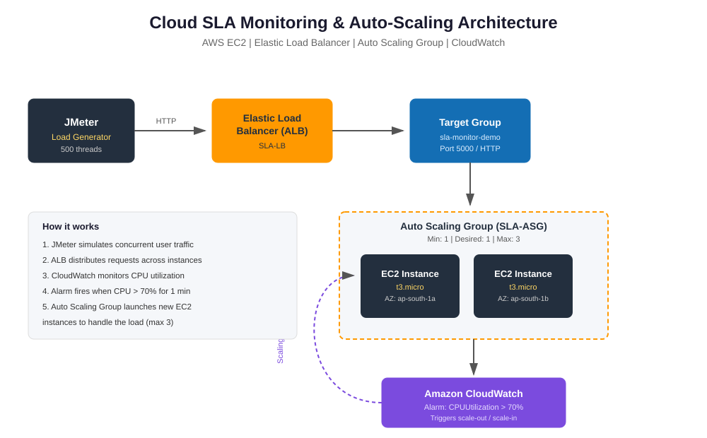

# Cloud SLA Monitoring & Auto-Scaling Demonstrator (AWS)

## Project Overview

This project demonstrates automatic scaling of cloud resources using AWS while monitoring Service Level Agreement (SLA) metrics. A Flask web application is deployed on Amazon EC2 behind an Application Load Balancer. Apache JMeter is used to generate traffic, and Amazon CloudWatch monitors CPU utilization to trigger Auto Scaling when the load increases.

---

## Features

- Deploy Flask application on AWS EC2
- Application Load Balancer for traffic distribution
- Auto Scaling Group for automatic instance scaling
- CloudWatch Alarm based on CPU utilization
- Load testing using Apache JMeter
- SLA monitoring and high availability

---

## Technologies Used

- Python (Flask)
- Amazon EC2
- Application Load Balancer (ALB)
- Auto Scaling Group (ASG)
- Amazon CloudWatch
- Apache JMeter
- GitHub

---

## Architecture



---

## Project Workflow

1. Deploy the Flask application on an EC2 instance.
2. Create a Target Group and Application Load Balancer.
3. Configure an Auto Scaling Group.
4. Set a CloudWatch alarm when CPU utilization exceeds 70%.
5. Generate traffic using Apache JMeter.
6. Observe automatic instance scaling and monitor SLA metrics.

---

## Screenshots

### Load Balancer


### Target Group


### Auto Scaling Group


### CloudWatch Alarm


### Apache JMeter Configuration


### EC2 Instances


### Apache JMeter HTTP Request


---

## Results

- Successfully deployed the Flask application on AWS.
- Configured Load Balancer and Target Group.
- Implemented Auto Scaling based on CPU utilization.
- Monitored application performance using CloudWatch.
- Simulated traffic using Apache JMeter.
- Achieved automatic scaling and improved availability.

---

## Repository Structure

```
Cloud-SLA-Monitoring-Auto-Scaling-Demonstrator/
│
├── README.md
├── architecture-diagram.svg
└── Screenshots/
    ├── screenshot 1.jpeg
    ├── screenshot 2.jpeg
    ├── screenshot 3.jpeg
    ├── screenshot 4.jpeg
    ├── screenshot 5.jpeg
    ├── screenshot 6.jpeg
    └── screenshot 7.jpeg
```

---

